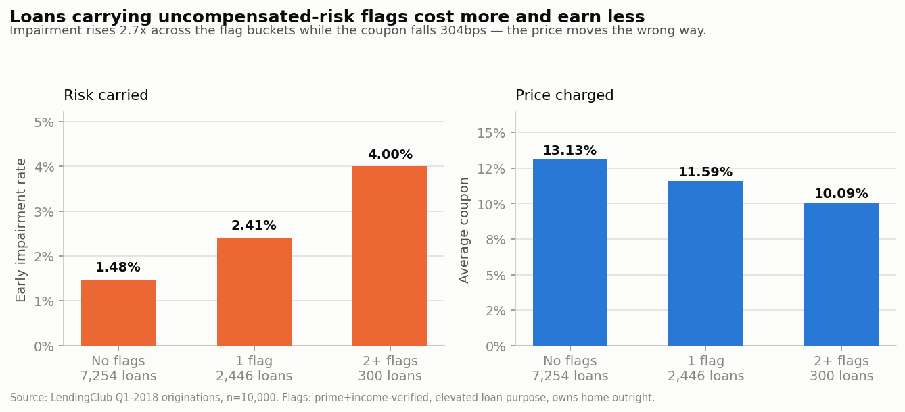
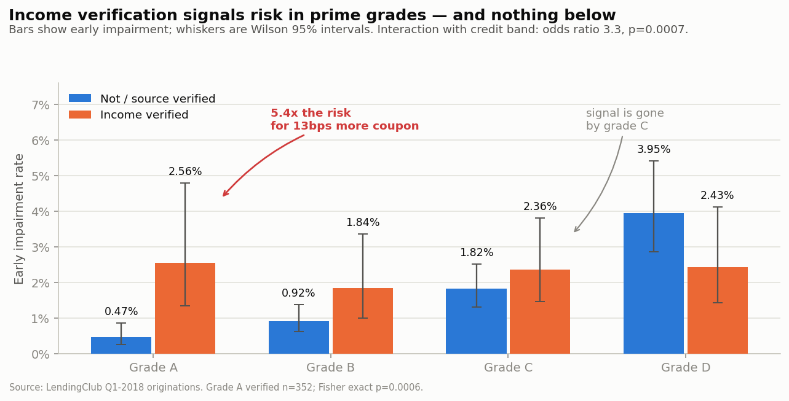
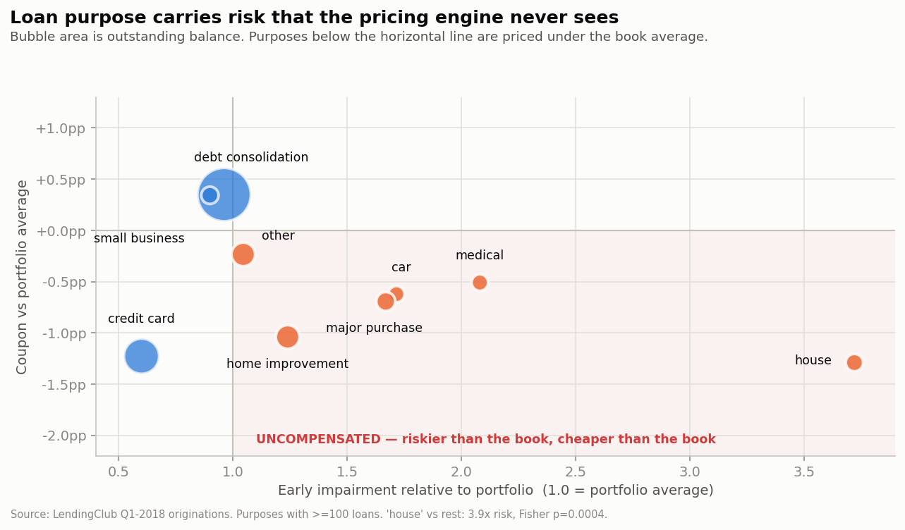
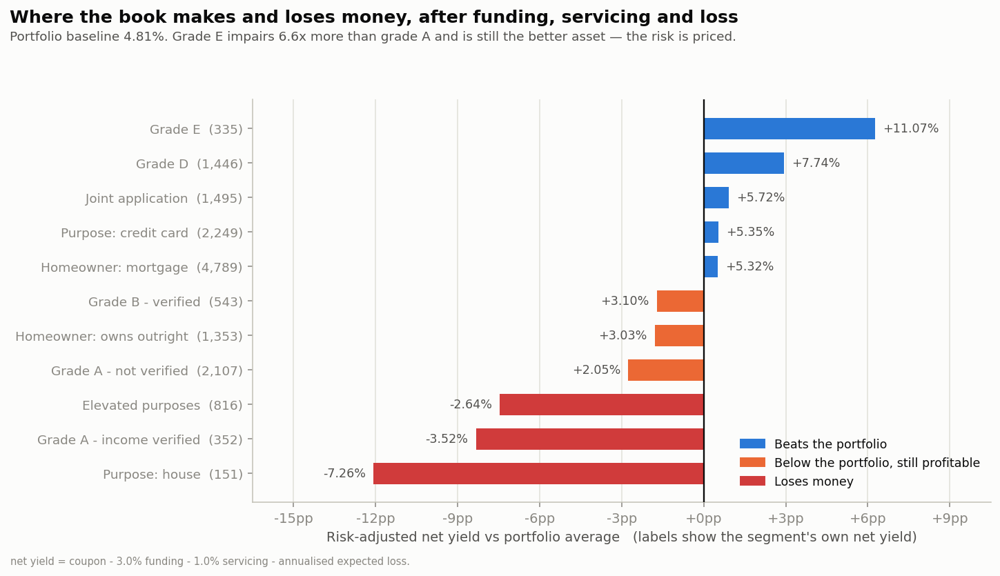
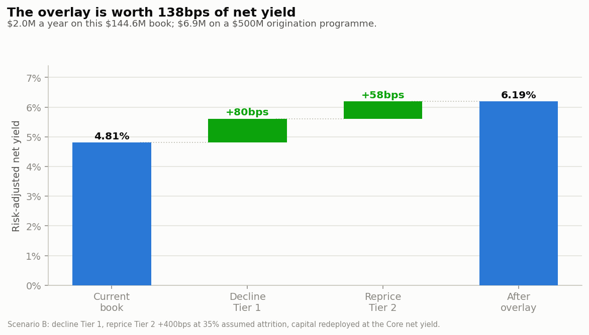
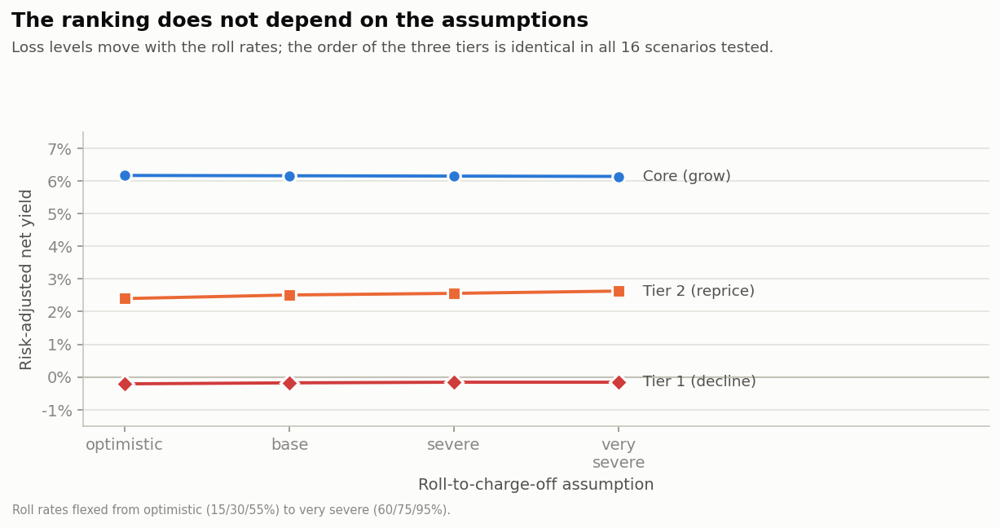

# Finding Risk That Nobody Charged For: A $163M Loan Book

I analysed 10,000 real LendingClub personal loans to answer one question: is this lender taking on risk it forgot to charge for? It is. I found about $2 million a year of it.

**Tools:** SQL (DuckDB), Python (pandas, scipy, statsmodels), HTML/JS dashboard

---

## Quick summary

A lender gave out $163.6 million in personal loans in the first three months of 2018. That is 10,000 loans. Four months later, 1.78% of them had already missed a payment.

On its own, 1.78% is a normal number. Nothing looks wrong. But I wanted to know *which* loans were missing payments, and whether the lender had charged enough interest on those loans to cover the losses.

Here is what I found. The lender's own credit grade (the A to G score it gives each borrower) works fine. Grade A loans go bad 0.77% of the time and grade E loans go bad 5.07% of the time, and the interest rate goes up faster than the risk does. So the grade is doing its job.

The problem is three things the grade does not look at:

1. Whether the lender checked the borrower's income, in the top credit grades
2. What the borrower said the loan was for
3. Whether the borrower owns their home outright, with no mortgage

All three predict missed payments. None of them change the interest rate. When a loan has two or more of them, it goes bad 4.00% of the time instead of 1.48%, and the lender actually charges it a *lower* rate.



27.5% of the loans are causing 44.1% of the losses. If the lender stopped making the two worst kinds of loans and charged more for a third kind, its profit margin would go from 4.81% to 6.19%. That is worth about $2.0 million a year on this book, or $6.9 million if they lend $500 million a year.

I tested that conclusion against 16 different sets of assumptions. It held up in all of them.

---

## 1. The business problem

Imagine you work for this lender and your boss asks you this:

> "Our loss rates look fine for every credit grade. Our pricing model is doing what we built it to do. So why is our overall profit margin below target?"

Both halves of that can be true at the same time. A pricing model can only charge for risk that it actually measures. If there is risk sitting in a field the model never looks at, the model will keep saying everything is fine while the money quietly leaks out.

So I did not try to prove the credit grade was wrong. I asked a smaller, more useful question:

**Which things about a borrower predict missed payments but do NOT change the interest rate they are charged?**

Anything on that list is risk the lender is carrying for free. My job was to find those things, work out how much money each one costs, and turn it into a rule the credit team could actually apply.

**One thing to be clear about:** the data is real. The company in this story is not. I wrote it as if I worked there, because a credit finding is only useful when you turn it into a decision and a dollar amount. Everything I claim comes from the data.

---

## 2. What I expected to find

Before I started, I wrote down six things I believed and what I would need to see to prove or disprove each one. I did this first on purpose, so I could not quietly drop the ones that did not work out.

Four of the six turned out to be wrong. Two of those wrong answers taught me more than the right ones.

| # | What I expected | Why I thought so | What actually happened |
|---|---|---|---|
| **H1** | Checking a borrower's income makes the loan safer | If you verify income, you know more, so you should lend better | **Wrong, and backwards.** In the top grades, verified loans went bad 2.96x MORE often (p=0.0004). In lower grades it made no difference at all (p=1.00) |
| **H2** | What the loan is for predicts risk, and the price ignores it | Someone borrowing for a medical bill is under more pressure than someone refinancing a credit card | **Right.** The riskier purposes went bad 2.37x more often (p=0.00004), and were charged 46bps LESS than average |
| **H3** | Borrowers with more debt relative to income are riskier | This is the standard affordability check every lender uses | **Wrong, and backwards.** The borrowers with the LEAST debt went bad most often (2.51%). Odds ratio 0.98, p=0.0019 |
| **H4** | 5-year loans are riskier than 3-year loans | More time to run into trouble | **Wrong, it was just a mix-up.** It looked true at first (p=0.011) but disappeared once I compared loans within the same credit grade (p=0.53). The grade already handles it |
| **H5** | Owning your home outright is a good sign | No mortgage payment means more spare cash each month | **Wrong, and backwards.** Outright owners went bad 1.51x more often than people with a mortgage (p=0.035) |
| **H6** | Two people on one loan is safer than one | Two incomes backing the same payment | **Wrong, but I did not act on it.** Joint loans did go bad 1.49x more often (p=0.033). But they are already charged enough to cover it (+5.72% margin), so there is nothing to fix |

That last row matters to me. Finding something statistically significant is not the same as finding a problem. Joint applications are riskier, and the lender is already being paid for that risk. Changing anything there would cost money, not save it.

---

## 3. The data I used

**Where it came from:** Real LendingClub loan records, published as `loans_full_schema` by [OpenIntro](https://www.openintro.org/data/index.php?data=loans_full_schema) and mirrored on [Rdatasets](https://github.com/vincentarelbundock/Rdatasets).

This is real lending data. I did not make up or simulate any of it.

| | |
|---|---|
| Number of loans | 10,000 |
| Total lent out | $163.6M |
| Still owed | $144.6M |
| When they were issued | January to March 2018 |
| How far along they are | About 4 to 5 monthly payments in |
| Average interest rate | 12.66% |
| Credit grade mix | A 24.6% · B 30.4% · C 26.5% · D 14.5% · E–G 4.1% |

There are 55 columns. They cover the borrower's credit history at the time they applied, the terms of the loan, and whether they are currently paying on time.

### How I decided what counts as a "bad" loan

The loans are only four months old. Nobody has properly defaulted yet, because that takes a year or more. So I could not measure defaults.

What I could measure is whether a borrower has **already missed a payment**. In the data that means the loan status is one of these:

```
In Grace Period       (1 to 15 days late)
Late (16-30 days)
Late (31-120 days)
Charged Off           (the lender has given up on it)
```

That is 178 loans, or 1.78%. In money, $3.00 million of what is still owed, or 2.07%.

Lenders watch this number closely on new loans, and there is a good reason. If you wait for real defaults, you find out you underwrote badly two years after you did it. Missing a payment in the first few months is the earliest warning you get.

### Things that are wrong with this analysis

I want to be upfront about the weak points, because I would rather explain them myself than have someone find them.

**1. The loans are young.** Four months of payment history tells you a lot about which groups of borrowers are worse than others. It tells you very little about how much money will actually be lost in total. So every dollar figure in this project depends on an assumption I had to make (I explain it in section 4). I built the recommendation so that it does not depend on that assumption being right, and I show that in section 7.

**2. I only see approved loans.** Everyone LendingClub turned down is invisible to me. So everything I found is true *among people who already passed their checks*, which is not the same as being true of everyone who applies.

**3. Some groups are small.** My biggest finding about loan purpose is based on 151 loans with 10 missed payments. If two of those borrowers had paid on time, the number would look very different. That is why I put a confidence range on every percentage in this project, and why I did not base any recommendation on a group whose range overlaps the portfolio average.

**4. It is one time period, and an easy one.** Early 2018 was a good economy. I would expect the *direction* of these findings to hold in a recession, but not the exact sizes. Checking that would need several years of loans.

---

## 4. How I did it

I split the work into two parts on purpose.

**SQL (DuckDB)** does all the counting and the money maths. Every business number in this README comes from a query you can find in the `sql/` folder and run yourself.

**Python** does the statistics: testing whether a difference is real or just luck, checking whether a finding survives once you account for credit grade, and stress-testing the assumptions.

```bash
pip install -r requirements.txt

python python/01_build_db.py          # load the CSV into a database, clean it
python python/02_run_sql.py           # run every SQL file, save the results
python python/03_statistical_tests.py # significance tests and regression
python python/04_sensitivity.py       # test the conclusions against 16 scenarios
python python/05_charts.py            # make the charts
```

### How I worked out whether a group of loans makes money

A group of loans is only a problem if it does not earn enough to cover what it costs to hold. So for every group I calculated:

```
profit margin = interest charged
              − cost of borrowing the money
              − cost of running the loans
              − expected losses
```

These are the numbers I used for the last three:

| Assumption | Value | Where it comes from |
|---|---|---|
| How often a late loan ends up written off (grace period / 16-30 days / 31-120 days) | 30% / 45% / 70% | Standard industry figures for unsecured personal loans |
| How much is lost when a loan is written off | 85% | These loans have no collateral, so you recover about 15% |
| Cost of borrowing the money | 3.0% | Roughly what funding cost in 2018 |
| Cost of running the loans | 1.0% | LendingClub's investor fee |
| Total losses expected over the loan's life | 9.0% | See below |

**About that last one.** These loans are only four months old, so they have not lost most of the money they are eventually going to lose. To estimate a full lifetime loss, I multiplied the losses I can see by a single number (8.81) chosen so the whole portfolio comes out at 9% lifetime losses, which is reasonable for this mix of credit grades.

That multiplier is an assumption, not something I measured, and I want to be clear about what it does and does not affect. Because it is one number applied to every single loan equally, it changes how big the losses look, but it cannot change which groups look worse than which other groups. Section 7 shows this rather than just claiming it.

---

## 5. What I found

### Finding 1: Checking someone's income means opposite things depending on their credit grade



Among grade A borrowers (the safest ones), the loans where LendingClub verified the income went bad **2.56%** of the time. The ones where it did not verify went bad **0.47%** of the time.

That is more than five times the risk. If there were really no difference between the two groups, a gap this big would turn up about once in every 1,800 tries (p=0.0006). And for all that extra risk, those borrowers were charged 13 basis points more. That is 0.13%, which is basically nothing.

What is strange is that this only happens at the top. In grades C and D the effect disappears completely, and in grade D it actually flips the other way.

I checked whether that flip was real by testing the two together in one model. It is: the difference between the two credit bands has an odds ratio of 3.3 with p=0.0007. Interestingly, if you just test "does verification predict risk" across the whole book, you get nothing (p=0.13), because the two opposite effects cancel each other out. You only see it if you split the book first.

**Why I think this happens.** LendingClub chooses who to verify. It is not random. So being asked to prove your income is itself a signal that something in your application did not add up on its own. Maybe your income changes month to month, maybe you work for yourself, maybe your paperwork was thin.

Then you prove your income, it checks out, and you get graded A. The *result* of the check is clean. But the *reason they asked in the first place* is information, and nobody is using it.

In lower credit grades, almost everyone gets verified as routine, so being asked tells you nothing. That is exactly what the data shows.

One loan in this book makes the point well: grade A, interest rate of 5.31%, and it is already 31 to 120 days late. The pricing model thought that was one of the safest loans it had.

### Finding 2: What the loan is for predicts risk, and nobody is charging for it



Everything below the horizontal line is charged less than the book average. Several of those are well to the right, meaning they are riskier than average.

| What the loan is for | Loans | Missed payments | Range I am confident in | vs the book | Interest vs the book |
|---|---|---|---|---|---|
| A house purchase | 151 | **6.62%** | 3.64% – 11.76% | 3.7x riskier | **1.29% cheaper** |
| Medical bills | 162 | 3.70% | 1.71% – 7.84% | 2.1x riskier | 0.51% cheaper |
| A car | 131 | 3.05% | 1.19% – 7.59% | 1.7x riskier | 0.62% cheaper |
| A big purchase | 303 | 2.97% | 1.57% – 5.55% | 1.7x riskier | 0.69% cheaper |
| Paying off a credit card | 2,249 | 1.07% | 0.72% – 1.58% | 0.6x, so safer | 1.23% cheaper |

I grouped the risky ones together (house, medical, car, big purchase and moving, 816 loans in total). As a group they go bad **3.80%** of the time against **1.60%** for everything else. If there were no real difference, a gap that size would turn up about once in every 25,000 tries (p=0.00004).

I also checked whether this was just a side effect of those borrowers having worse credit grades. It is not. Even comparing loans within the same grade, the odds ratio is 2.39 with p below 0.0001. It is the strongest thing I found outside the grade itself.

The credit card row is just as useful, and points the other way. Those loans are the *safest* in the book at 0.6x the average risk, and they are also charged less than average. Someone moving a credit card balance onto a fixed monthly payment is usually taking control of their finances, not losing control. The lender should want more of those, not just leave them alone.

Home improvement loans sit at 2.21%, with a confidence range of 1.34% to 3.61%. That range overlaps the book average, so I cannot say for sure they are worse. I left them out of my recommendations and put them on a watch list instead.

### Finding 3: The debt-to-income check is pointing the wrong way

Debt-to-income is the standard affordability test. You add up what someone owes each month and divide it by what they earn. Higher should mean riskier.

I split the borrowers into five equal groups from lowest to highest:

| Group | Debt-to-income | Loans | Missed payments | Range I am confident in |
|---|---|---|---|---|
| 1 (lowest debt) | 0.0% – 9.7% | 1,996 | **2.51%** | 1.91% – 3.29% |
| 2 | 9.7% – 15.1% | 1,995 | 1.30% | 0.89% – 1.90% |
| 3 | 15.1% – 20.3% | 1,995 | 1.20% | 0.81% – 1.78% |
| 4 | 20.3% – 27.0% | 1,995 | 1.95% | 1.43% – 2.66% |
| 5 (highest debt) | 27.0% – 469% | 1,995 | 1.90% | 1.39% – 2.60% |

The borrowers with the least debt, the ones an affordability check would call safest, missed payments twice as often as the middle group. When I tested it properly the odds ratio came out at 0.98 per point with p=0.0019. It is a real effect and it runs the opposite way to what everyone assumes.

My best guess is that low debt here does not mean the person is financially strong. It means they have a **thin credit file**. They have not borrowed much, so there is not much history to judge them on. The check is treating "has no debts" and "has proved they can handle debts" as the same thing, and they are not.

I did not turn this into a recommendation. I turned it into a warning. If someone on the credit team had suggested tightening the debt-to-income limit, this book shows it would have made things worse.

### Finding 4: The credit grade is working, so leave it alone



| Grade | Loans | Missed payments | Interest charged | Expected loss | Profit margin |
|---|---|---|---|---|---|
| A | 2,459 | 0.77% | 6.69% | 1.70% | **+0.99%** |
| B | 3,037 | 1.09% | 10.52% | 2.16% | +4.36% |
| C | 2,653 | 1.96% | 14.15% | 3.93% | +6.23% |
| D | 1,446 | 3.39% | 19.16% | 7.42% | +7.74% |
| E | 335 | 5.07% | 25.23% | 10.15% | **+11.07%** |

Grade E borrowers miss payments 6.6 times as often as grade A borrowers, and grade E loans make eleven times as much money. If you looked at the missed payment column on its own you would cut grade E, which is exactly the wrong end of the book to cut.

Grade A is actually the weakest thing the lender owns. At 6.69% interest, once you take off 4% for funding and running costs, there is only 2.69% left to absorb any losses at all. That is why finding 1 is expensive and not just interesting. Grade A has almost no room for a mistake.

I left grades F and G out of all of this. There are only 58 and 12 loans in them, which is far too few to say anything reliable.

### Finding 5: These problems stack up

| Warning signs on the loan | Loans | Share of money lent | Missed payments | Interest charged | Share of losses |
|---|---|---|---|---|---|
| None | 7,254 | 72.4% | 1.48% | 13.13% | 55.9% |
| One | 2,446 | 24.6% | 2.41% | 11.59% | 37.0% |
| Two or more | 300 | 3.1% | 4.00% | 10.09% | 7.1% |

Risk goes up. Price goes down. And the share of losses per dollar lent triples from the first row to the last.

The three warning signs are not just measuring the same thing twice, and not one of them affects the interest rate.

---

## 6. What I would recommend

I put every loan into one of three groups, each with an action rather than an observation.

### Group 1: Stop making these loans
**1,026 loans · $18.3M · profit margin −0.18%**

The rule: the loan is for buying a house, **or** it is grade A or B and the income was verified.

These loans do not earn enough to cover what they cost. The lender is paying to own them.

**Being honest about this one:** group 1 loses money under my main assumptions, and under 8 of the 12 stress tests I ran. Under the most generous set of assumptions it just about breaks even at +0.8%. It is the worst of the three groups in *every* test I ran, but it is only clearly loss-making in most of them, not all. If the credit team preferred a softer option, charging these loans an extra 6% instead of refusing them gets to a similar place. That maths is in `sql/04_decision_framework.sql`.

### Group 2: Charge these 4% more
**1,720 loans · $21.6M · profit margin +2.51%**

The rule: the remaining risky purposes (medical, car, big purchase, moving), **or** the borrower owns their home outright.

These do make money. They just make 3.65% less than the good loans while carrying more risk. The answer is to charge for the risk, not to refuse it.

### Group 3: Do more of these
**7,254 loans · $104.6M · profit margin +6.16%**

Everything else. In particular the lender should go after more credit card refinancing, more borrowers who have a mortgage, and more grade C to E loans, because those are the best returns in the book once you account for risk. Joint applications should be left exactly as they are: riskier, but already paid for.

### Four changes to how they work

1. **Put loan purpose and verification status into the pricing model.** They already collect both at application and then throw them away. This is the recommendation with the longest shelf life. The specific groups will shift over time. The fact that the model is blind to these fields will not.
2. **Record *why* income was verified, not just that it was.** Finding 1 says the trigger is where the information is. Nobody is currently saving it.
3. **Stop treating low debt-to-income as a good sign on its own.** Check how long the borrower's credit history is before giving them credit for it.
4. **Send the credit team a monthly watch list** of live loans carrying these warning signs. The query is in `sql/04_decision_framework.sql`.

---

## 7. What it is worth

### The two options

| | Profit margin | Improvement | On this $144.6M book | On $500M of lending |
|---|---|---|---|---|
| Doing nothing | 4.81% | — | — | — |
| **Option A:** stop group 1, lend that money to group 3 instead | 5.61% | **+0.80%** | +$1.16M | +$4.02M |
| **Option B:** option A, plus charge group 2 an extra 4% | **6.19%** | **+1.38%** | **+$2.00M** | **+$6.92M** |



### The one thing I had to guess

Option B assumes that when you charge people more, 35% of them walk away to a cheaper lender. I have no way to know that number from this data, so I tested every possible value:

| If this many leave | 0% | 20% | 35% | 50% | 70% | 100% |
|---|---|---|---|---|---|---|
| Improvement | +1.40% | +1.39% | **+1.38%** | +1.38% | +1.36% | +1.35% |

It barely matters. Even if every single repriced borrower leaves, the answer is still +1.35%, because the money they take with them gets lent to group 3 instead, which earns 6.16%.

### Does the answer survive if my assumptions are wrong?



I re-ran everything with the write-off assumptions set from optimistic (15/30/55%) to very pessimistic (60/75/95%). Then I moved the recovery rate, the funding cost, the running cost and the lifetime loss estimate one at a time.

That is 16 scenarios in total. **The order of the three groups was the same in all 16: group 3 best, group 2 middle, group 1 worst.**

The size of the losses moves around, which it should, because I am guessing at those. The ranking that the whole recommendation depends on does not move at all.

### How you would know if it actually worked

A number in a slide deck is not a result. This is how I would check:

| When | What to measure | What good looks like |
|---|---|---|
| Month 1 | How many applications the new rules flag | Around 27% of them, matching what I found here |
| Month 3 | How many group 2 borrowers accept the higher rate | 65% or more |
| Month 6 | Missed payments on new loans vs this book | Down from 1.78% to 1.35% or lower |
| Month 12 | Overall profit margin | Up from 4.81% to 5.90% or higher |
| Month 12 | Rejected applicants who got a loan elsewhere and paid it fine | Tracked, to catch rules that are too strict |

**Run it as a test, not a switch.** Keep 10% of qualifying applications on the old rules for a year. Without that comparison group, a good year in the economy will take the credit for your work and a bad year will get you blamed for it.

---

## 8. What I would do next

- **Check it holds on other years.** One set of loans from one good year is one data point. The verification finding is the one I would most want to see again in 2019 and 2020 loans.
- **Get the reason for verification.** I worked out the likely explanation for finding 1 by reasoning about it. The actual trigger reason would let me test it directly, and LendingClub already has that field.
- **Handle early repayment properly.** 447 borrowers paid their loan off completely within four months. Those are good customers leaving the pool, and I ignored that.
- **Build a scoring model, but later.** With only 178 missed payments, a model would learn noise. At two years and roughly 900 events, it would be worth doing properly with a proper out-of-time test. Deciding not to model yet was a deliberate choice, not something I skipped.

---

## What is in this repo

```
credit-risk-analysis/
├── README.md                      this write-up
├── requirements.txt
├── data/
│   ├── raw/loans_full_schema.csv  the real LendingClub data
│   └── README.md                  where it came from, what every column means
├── sql/
│   ├── 01_portfolio_overview.sql  the basics, and a check that the grade works
│   ├── 02_hypothesis_tests.sql    my six hypotheses, with confidence ranges
│   ├── 03_segment_economics.sql   profit margin by group
│   └── 04_decision_framework.sql  the three groups, the money, the watch list
├── python/
│   ├── 01_build_db.py             load and clean the data
│   ├── 02_run_sql.py              run the SQL, save the results
│   ├── 03_statistical_tests.py    significance tests and regression
│   ├── 04_sensitivity.py          the 16 stress tests
│   └── 05_charts.py               the charts above
├── dashboard/index.html           interactive dashboard, opens in any browser
└── outputs/
    ├── charts/                    the 6 charts
    └── tables/                    every result as a CSV
```

Everything here is produced by running those scripts on the raw CSV. I did not type any number into this README by hand, so if you change an assumption in `python/01_build_db.py` and re-run it, all of this updates.

## The dashboard

`dashboard/index.html` is a single file. Open it in a browser, no setup needed.

- **Drag the sliders** for how many borrowers leave and how much extra to charge, and the whole model recalculates in front of you.
- **Switch the main chart** between profit margin and missed payments, to see why looking at missed payments alone gets you the wrong answer.
- **Sort the hypothesis table**, including the ones I got wrong.
- **The monthly watch list**, which is what the credit team would actually receive.

The dashboard does no maths of its own. `python/06_dashboard_data.py` pulls the numbers out of the database and `python/07_build_dashboard.py` puts them into the page, so it cannot disagree with the analysis.

## Where the data came from

- [LendingClub `loans_full_schema`](https://www.openintro.org/data/index.php?data=loans_full_schema), published by OpenIntro
- [Direct CSV on Rdatasets](https://github.com/vincentarelbundock/Rdatasets/blob/master/csv/openintro/loans_full_schema.csv)
